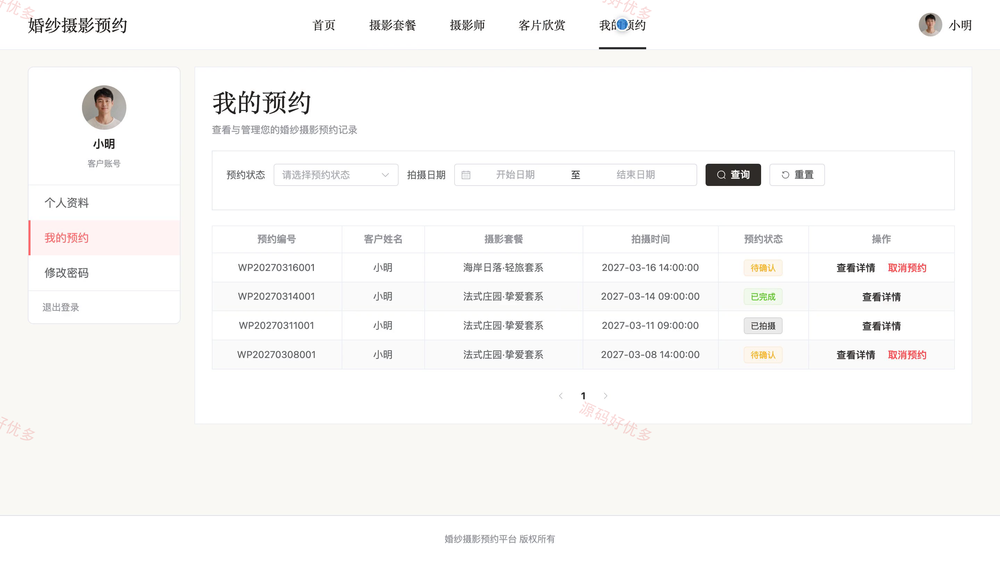
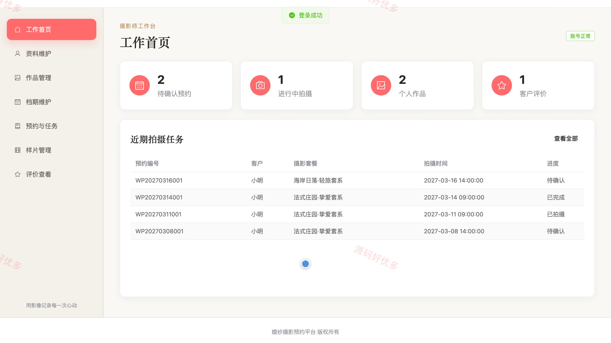
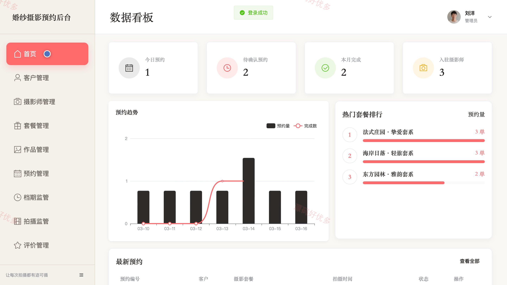
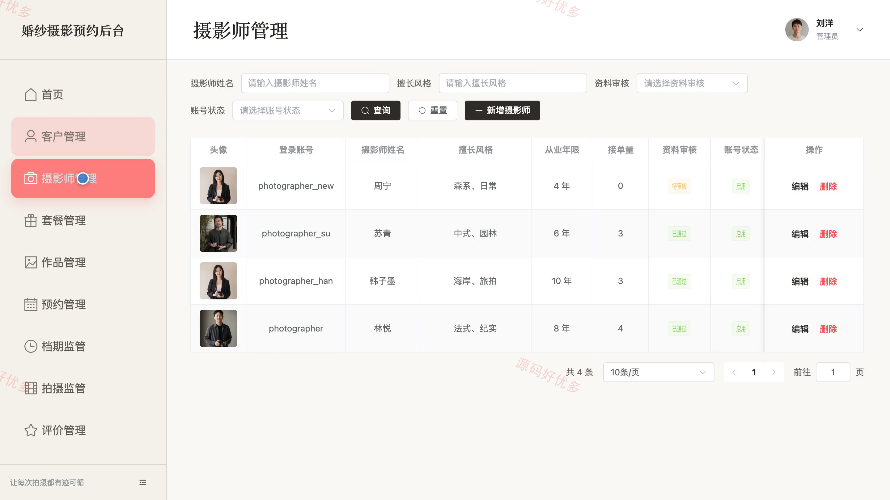
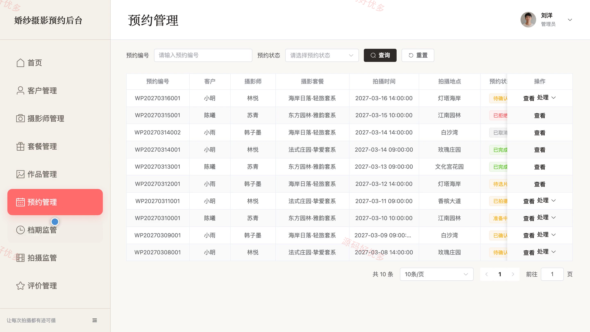

## 源码问题查看主页咨询

### 一、关键词
婚纱摄影预约、婚礼跟拍预订、摄影套餐选择、摄影师档期查询、婚纱客片服务

### 二、作品包含
源码+数据库+万字设计文档+PPT+全套环境和工具资源+本地部署教程

### 三、项目技术
前端技术： Html、Css、Js、Vue3.4、Element-Plus
后端技术：Java、SpringBoot3.2.0、MyBatis-Plus

### 四、运行环境（以下版本亲测，其他版本兼容性请自行测试）
开发工具：IDEA/eclipse + VSCODE

数据库：MySQL5.7+（共10张表）

数据库管理工具：Navicat10以上版本

环境配置软件： JDK17 + Maven

前端Nodejs：16+

浏览器：谷歌浏览器

### 五、项目介绍
项目编号：bs091A

婚纱摄影服务预约系统面向客户、摄影师和管理员，围绕摄影套餐与作品展示、摄影师档期查询、在线预约、拍摄进度、选片反馈和服务评价形成完整业务流程，并支持摄影师维护作品与档期、处理拍摄任务以及管理员统一监管预约和服务质量。

角色：客户、摄影师、管理员

客户功能：账号注册与登录、摄影套餐浏览与筛选、摄影师及客片作品查看、摄影师档期查询、摄影服务在线预约、预约详情与进度查看、样片选择与修图反馈、服务评价与个人资料维护。

摄影师功能：摄影师账号登录、个人资料与擅长风格维护、摄影作品管理、可预约档期维护、客户预约确认与拒绝、拍摄任务与进度更新、客户样片上传管理、客户评价查看。

管理员功能：平台数据统计、客户账号管理、摄影师资料审核与管理、摄影套餐管理、摄影作品审核与管理、预约与档期监管、拍摄进度监管、服务评价管理。

### 六、运行截图

